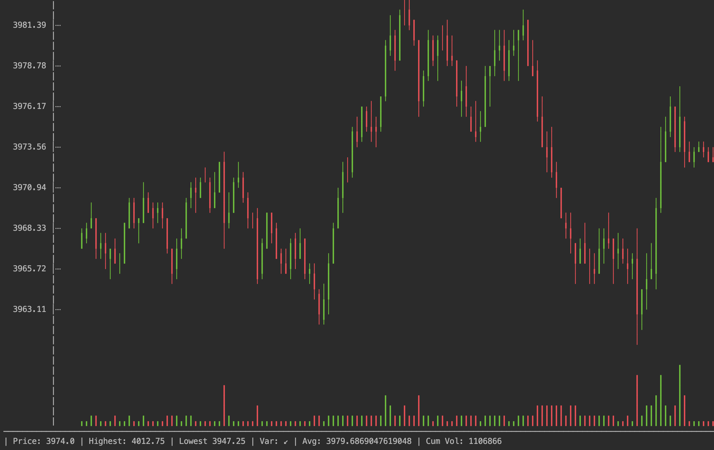

This is a kotlin port of the [cli-candlestick-chart](https://github.com/Julien-R44/cli-candlestick-chart) (developed by Julien-R44, written in Rust).

I didn't include any coloring libraries, so I've hard coded in terminal constants for green/red/reset.

Usage can be found in the test files (src/test/kotlin/ChartTests.kt)

Example:
